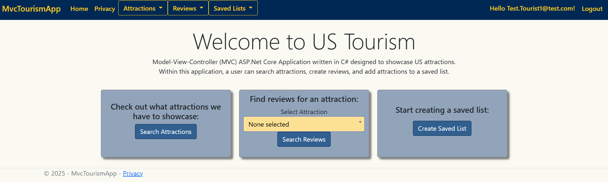
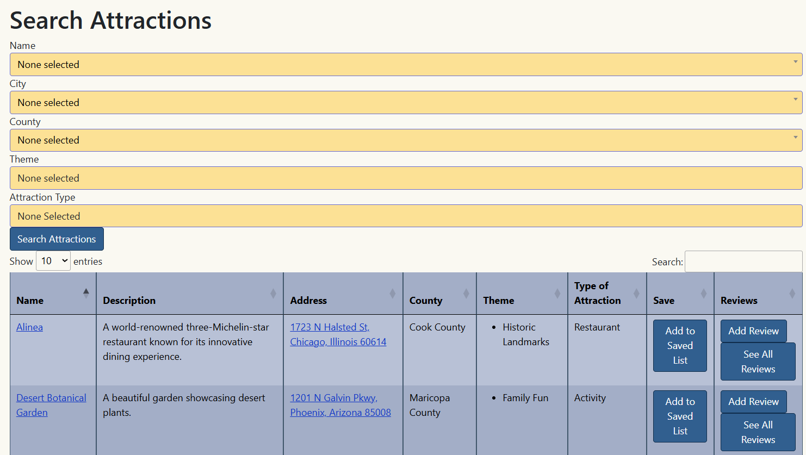

# Tourism Project

This is an ASP.NET Core MVC web application originally created for WVU's MIST-450 and MIST-452 courses (Fall 2022 - Spring 2023). This version is a recreated and modernized adaptation of my original work (April 2025).

## Table of Contents

- [Overview](#overview)
- [Features](#features)
- [Technologies Used](#technologies-used)
- [Requirements](#requirements)
- [Installation](#installation)
- [Test User Logins](#test-user-logins)
- [User Workflow](#user-workflow)
- [Screenshots](#screenshots)

## Overview

This ASP.NET Core MVC application centers around tourism in the United States, allowing users to browse attractions, read and write reviews, and save favorites to custom lists.

## Features

The following features are a combination of the original coursework and enhancements made in this updated version:

- ✅ Designed and implemented class diagram
- ✅ Test-Driven Development (TDD) using unit tests and mocking
- ✅ Agile Scrum practices with Azure DevOps
- ✅ CRUD operations across multiple entities
- ✅ Razor view rendering and layout design
- ✅ Responsive frontend using Bootstrap
- ✅ Implemented email sending functionality (SMTP-based notifications)
- ✅ Implemented Select2 for user-friendly searchable dropdowns
- ✅ Enhanced data display using DataTables (search, sort, paginate)
- ✅ Implemented Continuous Integration / Continuous Deployment (CI/CD) pipelines using Azure DevOps

## Technologies Used

- ASP.NET Core MVC
- Entity Framework Core
- LINQ (Language Integrated Query for data manipulation)
- SQL Server
- xUnit (for Test-Driven Development)
- Moq (for mocking dependencies during testing)
- Razor Views
- Bootstrap 
- JavaScript / jQuery
- MailKit / MimeKit (email sending)
- [Select2](https://select2.org/) (for enhanced dropdowns and search functionality)
- [DataTables](https://datatables.net/) (for interactive and searchable tables)
- Azure DevOps

## Requirements
- .NET 8.0 SDK
- Visual Studio 2022 (with ASP.NET and web development workload)
- SQL Server

## Installation

1. **Clone the repository in Visual Studio:**
   https://github.com/aphaf/TourismProject.git
2. **Update the default connection string:**
  In `appsettings.json`, replace the existing connection string with your local SQL Server setup:
   ```json
   "DefaultConnection": "Server=(localdb)\\mssqllocaldb;Database=TourismAppDb;Trusted_Connection=True;MultipleActiveResultSets=true;TrustServerCertificate=true;"
   ```
3. **Update the database:**
    Using the Package Manager Console in Visual Studio, run this command:
   ```
   update-database
   ```
4. **Run the application in Visual Studio**

## Test User Logins
To explore the application with pre-set data, you can use the following logins:
| Role      | Email                    | Password        |
|-----------|--------------------------|-----------------|
| Admin     | Test.Admin1@test.com     | Test.Admin1     |
| Moderator | Test.Moderator1@test.com | Test.Moderator1 |
| Moderator | Test.Moderator2@test.com | Test.Moderator2 |
| Tourist   | Test.Tourist1@test.com   | Test.Tourist1   |
| Tourist   | Test.Tourist2@test.com   | Test.Tourist2   |
> _These users are seeded automatically when initializing the database_

## User Workflow

### Tourist
- Browse and search attractions.
- Add new attractions to the site.
- Create and manage saved lists of favorite attractions.
- Write reviews / rate attractions.

### Moderator
- Edit or delete existing attractions.
- Approve or deny newly submitted attractions from users.
  
## Screenshots

### Home Page


### Search Attractions


> _To see more images, check under the library project: SolutionTourismApp/LibraryTourismApp/Screenshots_
